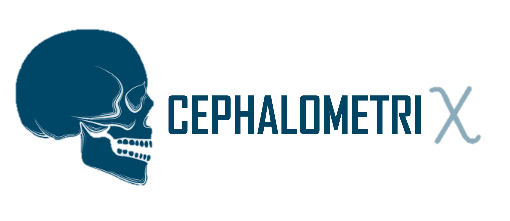

# CephalometriX - A Toolkit for Automated Cephalometric Analysis

<!-- Logo Placeholder -->
<p align="center">
    
</p>

## Overview
CephalometriX is a powerful Python toolkit designed for cephalometric landmark detection and analysis. It provides an intuitive framework for processing cephalograms, normalizing and resizing landmarks, and handling multiple datasets with ease.

## 📦 Datasets Supported
CephalometriX comes with built-in support for multiple cephalometric datasets:
- **AarizDataset**
- **ISBIDataset**
- **PKUDataset**

These datasets are accessible via:
```python
from .dataset import Dataset, Dataloader, Cephalogram
from .aariz import AarizDataset
from .isbi import ISBIDataset
from .pku import PKUDataset
from .paths import Paths
```

## 🛠️ Features
CephalometriX offers a range of functions for image and landmark processing, including:

### Image Processing
```python
def calculate_new_dimensions(height, width, max_size: int=512):
```
Rescales images while maintaining the aspect ratio.

```python
def resize(image: np.ndarray, landmarks: np.ndarray=None, dimensions: tuple=(int, int)):
```
Resizes images and adjusts landmark positions accordingly.

```python
def rescale(image, scale: float, offset: int = 0, dtype: str="float32"):
```
Applies scaling and offset transformations to images.

### Landmark Processing
```python
def normalize_landmarks(landmarks: np.ndarray, height: int, width: int, num_landmarks: int=19):
```
Normalizes landmark coordinates relative to image dimensions.

```python
def denormalize_landmarks(landmarks: np.ndarray, height: int, width: int, num_landmarks: int=19):
```
Reverts landmark normalization to absolute pixel coordinates.

## 🚀 Installation
Install CephalometriX via pip:
```bash
pip install cephalometrix
```

## 📖 Usage
Coming soon...

## 📝 Future Plans
- Expand dataset compatibility
- Implement deep learning-based landmark detection models
- Enhance visualization tools for cephalometric analysis

## 🤝 Contributing
We welcome contributions! Stay tuned for contributing guidelines.

## 📜 License
CephalometriX is open-source and licensed under the MIT License.

---
<p align="center">
👤 Developed by Machine Vision and Intelligent Systems
</p>
